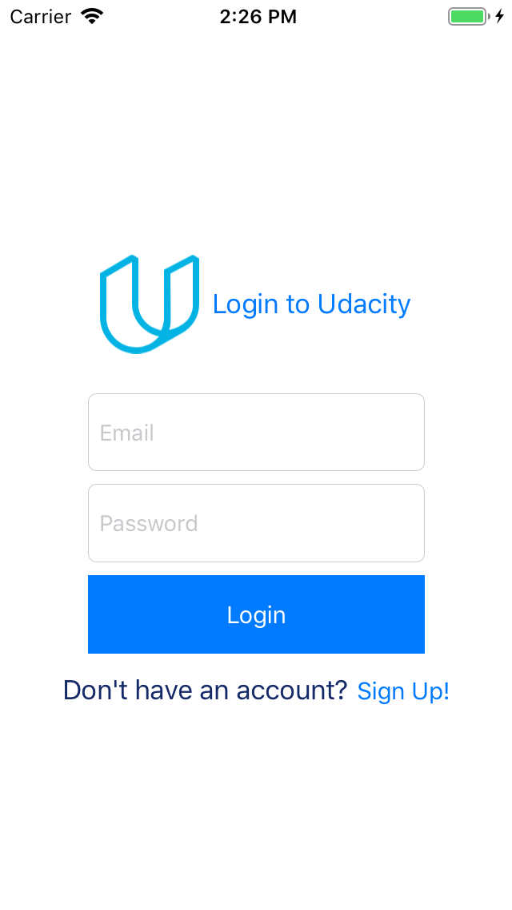
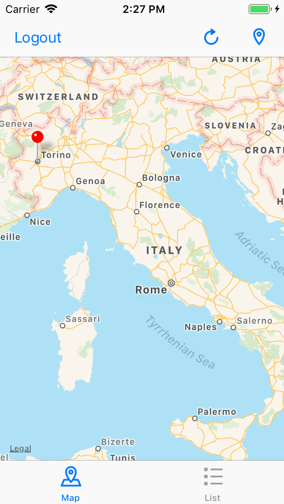
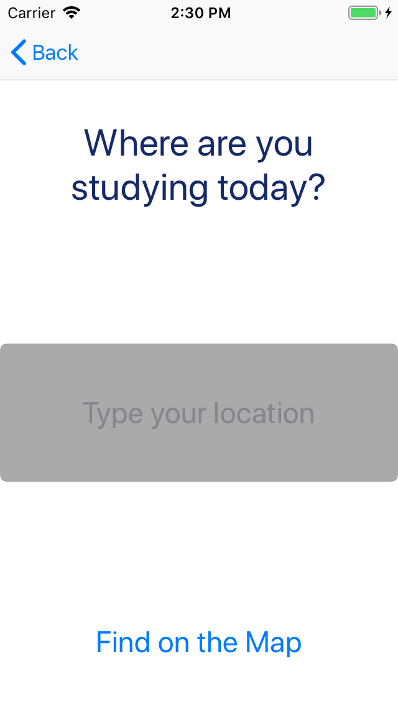
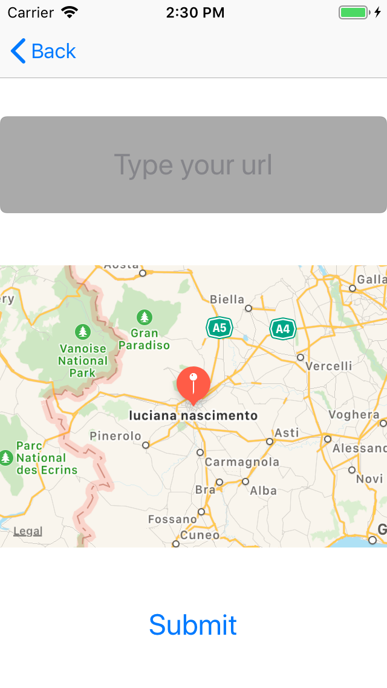

# OnTheMap

An iOS app that allows you to login via Udacity API, view student locations on the map and share your location with other students

## Technologies Used:

MapKit
 

Foundation
 

UITableView

## Frameworks Used:

UdacityAPI

UdacityParseAPI

## Build

This app was build in Swift 4.1 and Xcode 10.0

## Screenshots

   
